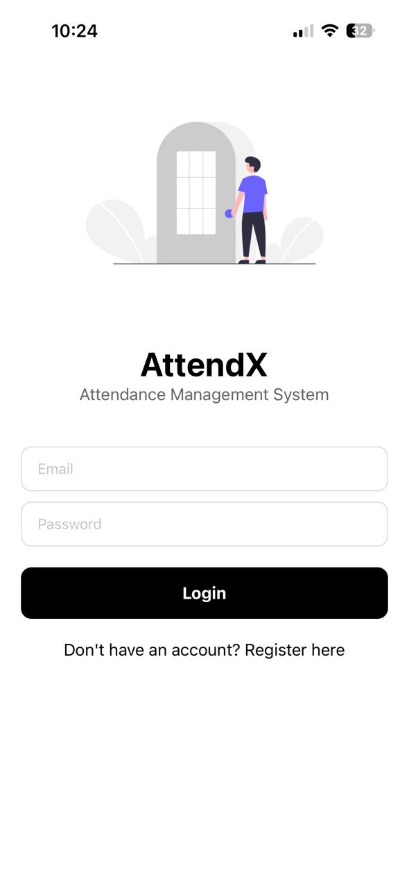
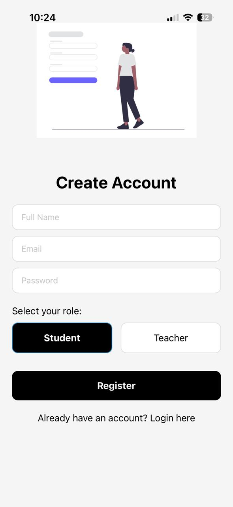

# AttendX - Attendance Management System

A modern React Native attendance management application built with Expo and Supabase, designed to streamline attendance tracking for educational institutions.

## 📱 Features

### 🎯 Core Features
- **User Authentication** - Secure login and registration system
- **Role-Based Access** - Separate interfaces for Teachers and Students
- **Class Management** - Teachers can create and manage classes
- **Attendance Tracking** - Real-time attendance marking with unique codes
- **Student Enrollment** - Easy student enrollment in classes
- **Dashboard Analytics** - Comprehensive attendance statistics

### 🔐 Authentication System
- Email/Password authentication via Supabase Auth
- Role-based access control (Teacher/Student)
- Secure session management
- Profile management

### 📊 Teacher Features
- Create and manage classes
- Generate attendance codes with expiry times
- Mark attendance for students
- View class attendance reports
- Manage student enrollments

### 👨‍🎓 Student Features
- View enrolled classes
- Mark attendance using class codes
- Track personal attendance history
- View attendance statistics

## 🛠 Tech Stack

### Frontend
- **React Native** - Cross-platform mobile development
- **Expo** - Development platform and toolchain
- **TypeScript** - Type-safe development
- **React Navigation** - Navigation and routing
- **React Native Async Storage** - Local data persistence

### Backend & Database
- **Supabase** - Backend-as-a-Service
- **PostgreSQL** - Primary database
- **Supabase Auth** - Authentication service
- **Row Level Security (RLS)** - Data protection

### Development Tools
- **Prisma** - Database ORM and migrations
- **ESLint** - Code linting
- **Prettier** - Code formatting

## 🚀 Getting Started

### Prerequisites
- Node.js (v18 or higher)
- npm or yarn
- Expo Go app (for testing)
- Supabase account

### Installation

1. **Clone the repository**
   ```bash
   git clone https://github.com/kunalg12/AttendX.git
   cd AttendX
   ```

2. **Install dependencies**
   ```bash
   npm install
   ```

3. **Environment Setup**
   ```bash
   cp .env.example .env
   ```
   
   Update `.env` with your Supabase credentials:
   ```env
   EXPO_PUBLIC_SUPABASE_URL=your_supabase_url
   EXPO_PUBLIC_SUPABASE_KEY=your_supabase_anon_key
   DATABASE_URL=your_database_connection_string
   ```

4. **Database Setup**
   - Run the SQL migration in `supabase/migrations/20250806072413_create_tables.sql`
   - Run the profile creation script in `supabase/migrations/create_user_profiles.sql`

5. **Start the development server**
   ```bash
   npx expo start
   ```

6. **Run the app**
   - Scan QR code with Expo Go (iOS/Android)
   - Or use `npx expo start --ios` / `npx expo start --android`

## 📱 Screenshots

### Authentication Screens

#### Login Screen
<div style="text-align: center;">
  
</div>
*Clean and intuitive login interface with email and password fields*

#### Registration Screen  
<div style="text-align: center;">
  
</div>
*User registration with role selection (Teacher/Student)*

### Dashboard Screens

#### Teacher Dashboard
<div style="text-align: center;">
  
</div>
*Comprehensive dashboard for teachers to manage classes and attendance*

#### Student Dashboard
<div style="text-align: center;">
  
</div>
*Student view for enrolled classes and attendance tracking*

## 🏗 Project Structure

```
AttendX/
├── screens/                 # React Native screens
│   ├── LoginScreen.tsx     # Login interface
│   ├── RegisterScreen.tsx  # Registration interface
│   ├── student/            # Student-specific screens
│   └── teacher/            # Teacher-specific screens
├── lib/                    # Utility libraries
│   └── prisma.ts          # Prisma client configuration
├── supabase/               # Database configurations
│   └── migrations/         # SQL migration files
├── prisma/                 # Prisma ORM configuration
│   ├── schema.prisma      # Database schema
│   └── prisma.config.ts   # Prisma configuration
├── assets/                 # Images and assets
├── App.tsx                # Main app component
├── supabaseConfig.ts      # Supabase client configuration
└── .env                   # Environment variables (not tracked)
```

## 🗄 Database Schema

### Core Tables

#### Profiles
- User profiles with role assignment
- Links to Supabase Auth users
- Contains email, full name, and role

#### Classes
- Class information and management
- Teacher assignment
- Creation and modification timestamps

#### Attendance
- Attendance records for students
- Links classes and students
- Date and status tracking

#### Attendance Codes
- Temporary codes for attendance marking
- Expiry time management
- Class association

## 🔐 Security Features

- **Row Level Security (RLS)** - Database-level access control
- **JWT Authentication** - Secure token-based auth
- **Environment Variables** - Sensitive data protection
- **Input Validation** - Client and server-side validation
- **Secure Password Storage** - Hashed passwords via Supabase

## 🧪 Testing

### Manual Testing
1. **Authentication Flow**
   - User registration and login
   - Role-based navigation
   - Session management

2. **Teacher Functions**
   - Class creation and management
   - Attendance code generation
   - Student enrollment

3. **Student Functions**
   - Class enrollment
   - Attendance marking
   - History viewing

### Test Credentials
- **Admin**: `admin.attendx@yopmail.com` / `admin123`
- **Teacher**: `teacher.attendx@yopmail.com` / `teacher123`

## 🚀 Deployment

### Expo Production Build
```bash
npx expo build:android
npx expo build:ios
```

### App Store Deployment
1. Build production APK/IPA
2. Submit to respective app stores
3. Configure app store listings

## 🤝 Contributing

1. Fork the repository
2. Create a feature branch (`git checkout -b feature/amazing-feature`)
3. Commit your changes (`git commit -m 'Add amazing feature'`)
4. Push to the branch (`git push origin feature/amazing-feature`)
5. Open a Pull Request

## 📝 License

This project is licensed under the MIT License - see the [LICENSE](LICENSE) file for details.

## 🙏 Acknowledgments

- **Supabase** - Backend services and authentication
- **Expo** - React Native development platform
- **React Native** - Mobile app framework
- **Prisma** - Database ORM and tools

## 📞 Support

For support and questions:
- Create an issue on GitHub
- Email: support@attendx.com
- Documentation: [Project Wiki](https://github.com/kunalg12/AttendX/wiki)

## 🔮 Future Enhancements

- [ ] Push notifications for attendance reminders
- [ ] Offline mode support
- [ ] Advanced analytics and reporting
- [ ] Multi-language support
- [ ] Integration with calendar systems
- [ ] Biometric authentication
- [ ] Export functionality (PDF/Excel)
- [ ] Parent portal access
- [ ] Bulk attendance operations
- [ ] Location-based attendance

---

**Built with ❤️ for educational institutions**
